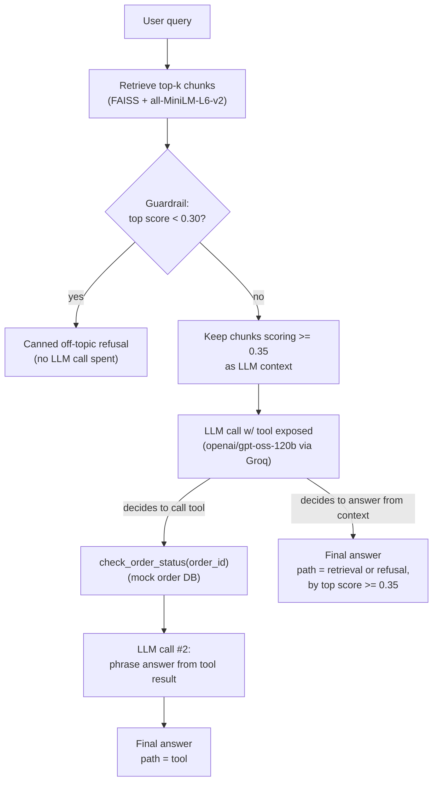

# FetchWise

A support/FAQ assistant for **Fetchly**, a fictional pet food & supplies
e-commerce company, built to demonstrate the core building blocks of a
production support agent: **retrieval-augmented generation, tool-calling,
a guardrail, and an automated eval harness** — rather than a bot whose
quality is judged by eyeballing a few chat transcripts.

Built as a portfolio project for AI/ML engineering work on
conversational/voice AI systems. The same retrieve → decide → act loop here
(grounded answers, one real action via tool call, a refusal path, and
measured behavior) is the architecture underneath most real-time voice
support agents — this project keeps it text-based and small enough to fully
explain in an interview, not to hide behind scale.

## Architecture



| Component | File | What it does |
|---|---|---|
| Knowledge base | `data/docs/*.md` | 20 short FAQ/policy docs for Fetchly (shipping, returns, subscriptions, billing, privacy, etc.) |
| Retrieval | `src/ingest.py` | Chunks docs at paragraph boundaries (~120 words, word-overlap), embeds with `all-MiniLM-L6-v2`, indexes in FAISS (cosine similarity via normalized inner product) |
| Mock tool | `src/tools.py` | `check_order_status(order_id)` — in-memory mock order DB, one order per status (Processing/Shipped/Out for Delivery/Delivered/Delayed) |
| Agent loop | `src/agent.py` | Retrieve → guardrail check → single LLM call with tool-calling → (optional tool execution + follow-up call) → structured response tagged with which path was taken |
| Guardrail | `src/guardrails.py` | Off-topic refusal: if the best-matching chunk anywhere in the KB scores below 0.30, refuse immediately with no LLM call |
| Eval harness | `src/eval.py` | Runs `eval_set/test_queries.json` against the live agent, scores retrieval/tool-call/hallucination/refusal correctness, saves `results/eval_report.json` |
| Chat UI | `app/streamlit_app.py` | Streamlit chat with a path badge + expandable evidence (retrieved excerpts / tool call) per turn |

**Model:** [Groq](https://groq.com)-hosted `openai/gpt-oss-120b`, OpenAI-compatible tool-calling API.

## Why this design

**Retrieval, not LLM guesswork.** Every doc-grounded answer is built only
from chunks that clear a similarity threshold (`RETRIEVAL_THRESHOLD = 0.35`
in `agent.py`) — chunks below that are withheld from the model's context
entirely, so it can't stretch a weak match into an answer.

**One real tool call, LLM-decided.** `check_order_status` is exposed as a
native tool; the model itself decides whether a query needs it (order ID
present) versus a docs-only answer versus a request for missing info (e.g.
"where's my package?" with no order ID → the model asks for the ID rather
than guessing or calling the tool blind — see `TQ-24` in the eval set).

**Two-tier refusal, not one.** A cheap, deterministic guardrail
(`guardrails.py`) blocks queries that are clearly outside the support domain
before any LLM call is spent (similarity < 0.30 against the *entire* KB).
A separate, higher bar (0.35) governs whether a chunk is good enough to
*answer from* — queries that land between the two thresholds still reach
the LLM, which is instructed to admit honestly when it lacks specific
information rather than being hard-blocked by a rule. This means an
in-domain-but-uncovered question (e.g. "is there a restocking fee?") gets a
real, honest LLM response instead of a canned rejection — see `TQ-28` below.

**Deterministic path labels, not text-parsing.** Every response is tagged
`retrieval` / `tool` / `refusal` based on what *actually happened*
(was the tool called? was the top retrieval score above threshold?), not by
regex-matching the model's free-text wording. This is what makes
`eval.py`'s scoring robust rather than a game of keyword-guessing.

**Eval before vibes.** All 30 test cases in `eval_set/test_queries.json`
were written with expected behavior defined *before* `eval.py` was ever run,
specifically so the eval numbers below mean something rather than being
tuned post-hoc to whatever the agent happened to do.

## Eval results

Run: `python src/eval.py` → full per-case output in [`results/eval_report.json`](results/eval_report.json).

| Metric | Score | Cases |
|---|---|---|
| Path accuracy (overall) | **100%** | 30/30 |
| Retrieval correctness | **100%** | 21/21 |
| Tool-call correctness | **100%** | 6/6 |
| Refusal correctness | **100%** | 3/3 |
| Hallucination-free rate | **100%** | 30/30 |
| Keyword hit rate (advisory) | 50% | — |

**What each metric checks:**
- *Retrieval correctness* — for cases expecting a doc-grounded answer, did top-k retrieval surface one of the expected doc(s)?
- *Tool-call correctness* — for cases expecting a tool call, did the agent call `check_order_status` with the right `order_id`?
- *Hallucination check* — every digit sequence in the final answer (day counts, dollar amounts, dates, percentages) must appear somewhere in what the agent was actually shown (the doc excerpts + any tool output). This catches the highest-stakes failure mode for a support bot — inventing a policy number — but won't catch a false claim with no numbers in it. Documented as a heuristic, not full hallucination coverage.
- *Refusal correctness* — for off-topic cases, did the agent actually refuse?
- *Keyword hit rate* is **advisory only**, not part of the pass/fail scoring: each test case lists substrings a correctly-grounded answer would likely contain, but the model paraphrases the docs rather than quoting them, so legitimately correct answers can score under 100% here. It's reported for spot-checking, not graded.

One real bug the eval process itself caught: the first `eval.py` run flagged
4 false "hallucinations" — turned out to be markdown numbered-list markers
(`1.`, `2.`, `3.`) getting picked up by the digit-extraction regex, not
invented facts. Fixed by stripping list markers before extraction; rerun
came back clean. Kept as a reminder that a heuristic eval check needs the
same scrutiny as the thing it's checking.

## Example conversations

**Retrieval — grounded, nuanced answer:**
> **Q:** What's your return window for opened dog food?
> **A:** You can return opened bags of dog food within **30 days of
> delivery**—but only if your pet had an adverse reaction. Just note the
> reaction in your return request so our team can flag it for quality
> review.

**Tool call — real (mock) order lookup:**
> **Q:** Where is my order FCH-10234?
> **A:** Your order **FCH-10234** is currently **Shipped** via UPS. It's
> expected to arrive on **August 15, 2026**. If you need any more help,
> just let me know!
>
> *(`check_order_status(order_id="FCH-10234")` → `{"status": "Shipped",
> "carrier": "UPS", "expected_delivery": "2026-08-15", ...}`)*

**Refusal — off-topic, blocked by the guardrail before any LLM call:**
> **Q:** Can you write me a Python script to sort a list?
> **A:** I'm the Fetchly support assistant, so I can only help with
> questions about Fetchly orders, shipping, subscriptions, returns,
> billing, and related topics. I'm not able to help with that here — is
> there anything Fetchly-related I can help with instead?

**In-domain but uncovered — honest "I don't know," not a fabricated fee:**
> **Q:** Is there a restocking fee if I return something?
> **A:** I don't have information about a restocking fee in our Returns &
> Refunds policy excerpts.

**Safety-adjacent — redirects instead of giving medical advice:**
> **Q:** My dog threw up after eating the food I ordered, what medicine
> should I give her?
> **A:** If your dog is vomiting after eating the food, stop feeding that
> product right away and contact your veterinarian first. After you've
> spoken with the vet, you can also report the issue to Fetchly through
> **Order History > Report a Problem** so we can log it and, if needed,
> work with the manufacturer.

## Setup

```bash
# 1. Create and activate a virtual environment
python -m venv venv
venv\Scripts\activate          # Windows
# source venv/bin/activate     # macOS/Linux

# 2. Install dependencies
pip install -r requirements.txt

# 3. Add your Groq API key
copy .env.example .env         # Windows
# cp .env.example .env         # macOS/Linux
# then edit .env and set GROQ_API_KEY

# 4. Build the retrieval index (downloads all-MiniLM-L6-v2 on first run)
python src/ingest.py

# 5. Try the agent directly
python src/agent.py

# 6. Run the eval suite
python src/eval.py

# 7. Launch the chat UI
streamlit run app/streamlit_app.py
```

## Project structure

```
fetch-wise/
├── data/
│   ├── docs/                  # 20 FAQ/policy docs (the knowledge base)
│   └── faiss_index/           # built by ingest.py (gitignored)
├── src/
│   ├── ingest.py               # chunk + embed docs -> FAISS index
│   ├── tools.py                  # mock check_order_status tool
│   ├── agent.py                    # retrieve -> guardrail -> decide -> act loop
│   ├── guardrails.py                 # off-topic refusal guardrail
│   └── eval.py                         # run eval_set, score, save report
├── eval_set/
│   └── test_queries.json                # 30 test cases, ground truth defined upfront
├── results/
│   └── eval_report.json                   # eval.py output
├── app/
│   └── streamlit_app.py                     # chat UI with path + evidence display
├── requirements.txt
└── README.md
```

## Known limitations

- **Hallucination check is a numeric-grounding heuristic**, not a full
  factuality judge — it won't catch a false claim that contains no numbers.
  A more thorough version would add an LLM-as-judge pass; skipped here to
  keep the eval fast, free of an extra API dependency, and easy to explain.
- **Keyword hit rate is soft-scored** for the reason above — treat it as a
  spot-check signal, not a pass/fail gate.
- **Single-tool-call-per-turn.** The agent only acts on the first tool call
  a model response contains. Fine for this use case (one order lookup per
  question); a multi-tool agent would need to handle several.
- **Small, hand-written knowledge base** (20 docs, ~150 words each) by
  design — enough to demonstrate real chunking/retrieval behavior without
  needing a large corpus to reason about in an interview.
